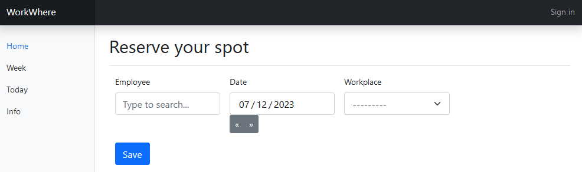
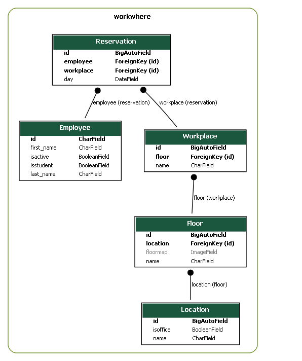

# WorkWhere documentation



#### Table of content

- [General information](#general-information)
- [Installation](#installation)
- [HowTo for users](#howto-for-users)
- [HowTo for admins](#howto-for-admins)
- [Model structure](#model-structure)


## General information

This app is made for smaller enterprises (less than 50 workplaces). The offices might be distributed over different buildings or office floors. Maps for the office floors can be added and can be opened from below the reservation form. 

For larger enterprises with more than 50 workplaces, the views become inconvenient and would require different layouts, more search options or other changes currently not foreseen.

Reservations can be done for complete days only.

The app can be used as a pure office workplace reservation app or as a more general tool where employees also add if they e.g. work from home office, are on business travel, or not available. However, for the latter, there are currently no views implemented to show the status per employee.

The app is following an open concept, where each employee can make reservations for each employee or also change other employee's reservations. This keeps the app and its usage simple and allows that employees can also ask colleagues to add or change a reservation for them. In order for this to work well, employees therefore need to use the app responsibly.

## Installation

For the installation of WorkWhere see the [README](../README.md) file. Note that you need to have a server with a Django project running in order to use the app. For more information on installing Django or creating a Django project see the [Django docs](https://docs.djangoproject.com).

## HowTo for users

The WorkWhere app has four pages for the general user which are explained in the following.

**Home**. Reservations are done on the front page of the app by the following steps:

1. Search and select your name in the employee field. If your name is not in the list, ask your admins to add it.
2. Select the date for your reservation. Reservations can only be made for working days.
3. Choose one of the workplaces. Only available workplaces for that date are shown.
4. Click the `Save` button

You can only do reservations for full days.
There might be additional options to choose from in the workplace field or special rules which apply for specific workplaces. Those will be specified by your admins and/or on the _Info_ page.

In order to see where the workplaces are located, open the floor maps shown below the reservation form.

**Week**. Shows the availability of all workplaces for one full week. One can also switch to the next or the previous week.

**Today**. Shows the status of the workplaces for the current day. This page is updated every 30 seconds. It can therefore be opened on a screen at the entrance of an office, so employees can see where they reserved on that day, where other colleagues are sitting or where to find free spots.

**Info**. This page can show additional info for the user like specific rules or a simple HowTo description.


## HowTo for admins

After a fresh installation, the admin has to complete a few steps before the page is ready for users. This is done on the admin page of the Django project.

1. Add the employees to the _Employees_ table. Each employee needs to have a unique ID. The distinction of students and non-students is used by a admin summary view for evaluating the office occupancy. Employees which are set to inactive don't appear in the list of the reservation form anymore.
2. Add the locations to the _Locations_ table. Locations can for example represent an office building which contains several office floors.
3. Add the floors to the _Floors_ table. Each floor belongs to one location and can have one floor map associated to it, indicating the location of workplaces. If a floormap is added, it will be linked on the front page.
4. Add the workplaces to the _Workplaces_ table. Each workplace belongs to one floor.
5. Add a _Settings_ entry. Here you can e.g. specify the region for your offices, which sets the holidays (days where no reservations can be made), and other settings.
6. Add entries to the _Infotexts_ table. These entries are shown in an accordeon view on the info page of the app. Each entry corresponds to a section on that page. The content can be formatted using HTML.

After completing the above steps, the app is ready to be used. Later, regular tasks for admins are to add new employees or remove ex-employees.

**Special workplaces**

Workplaces on floors associated to locations set to _isoffice=false_ can be reserved multiple times on the same day by multiple employees. They are therefore not used as usual workplaces in an office, but can be used in different ways:

- In order to allow employees to remove reservations, create a `Location(isoffice=False, name=Other)` and `Floor(location=Other, name=Other, floormap=_)`. Furthermore, create a workplace as `Workplace(floor=Other, name=REMOVE)`. Employees can then change their existing reservation to the "workplace" REMOVE, effectively making available the reserved spot.
- In order to add options like _home office_, _business travel_, or _not working_, create workplaces with those names and add them to the floor _Other_ as mentioned above. Such options could then be evaluated in order to get e.g. an average home office rate. Currently, an evaluation considering these special "workplaces" is not implemented.

## Model structure



This diagram was created using graphviz and django-extensions with the command
```
python manage.py graph_models workwhere -X SingletonModel,Settings,Infotext -g -o model_diagram.png
```